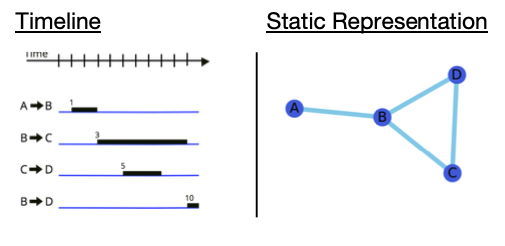

# Temporal Networks Clustering

 
&emsp; 

## Introduction
Welcome, this repository is used to track code related to one of my theses for my Bsc Hons in Mathematical Sciences (UCC Class 2019).
The goal of this thesis is to investigate and make additions to methods used to define clustering in temporal networks. In particular we investigate a dataset relating to human interactions at a conference.

## Abstract
The concept of clustering is well established in network science and useful to quantify the local cohesiveness of a network [15]. The local clustering coefficient, for instance, can be computed as the fraction of existing links between neighbours of a node and the maximum size of its neighbourhood [10]. Among other phenomena, this - together with a shortest average path length - explains the notion of small-world networks. Many networks, however, undergo temporal changes, which modify their structure. Then, the neighbourhood is also subject to change and the temporal ordering of link appearance becomes important to preserve causality. In this project, we aim to extend the concept of clustering to time-varying networks and apply it to both empirical and generic networks.

In this report we introduce the concept of a temporal network [6]. We extend the concept of network clustering and path lengths from the static case to the temporal case. Using these measures we implement heuristic algorithms and apply these algorithms to a real-world network [14]. In addition we highlight the drawbacks of static networks through identifying the number of non-causal paths in such networks [7]. Through varying time aggregations we will optimise the time frame over which we analyse a temporal network. Furthermore, we will extend the concept of a small-world network [10] through simulating the Watts-Strogatz model for temporal networks.
 
## Where to find the data
The data can be accessed at http://www.sociopatterns.org/datasets/sfhh-conference-data-set/. 
The data file is in the usual format representing the active contacts during 20-second intervals of the data collection. Each line has the form “t i j”, where i and j are the anonymous IDs of the persons in contact, and the interval during which this contact was active is [ t – 20s, t ] (t is expressed in seconds).

## Accessing the report & code
The written report can be found in the form of a pdf in the report folder of this repository. The source code for the project can be found within the src folder.

## Further contact
**Supervisor:** Philipp Hoevel (philipp.hoevel@ucc.ie)

**Author:** Peter David Fagan (peterdavidfagan@gmail.com)

## Literature
[6] Nicosia Vincenzo, John Tang, Cecilia Mascolo, Mirco Musolesi, Giovanni Russo, & Vito Latora (2013). Graph Metrics for Temporal Networks. Temporal Networks, Understanding Complex Systems. Springer-Verlag Berlin
Heidelberg, p. 15.

[7] H. K. Lentz, Thomas Selhorst, and Igor M. Sokolov (2012). Unfolding Accessibility Provides a Macroscopic Approach to Temporal Networks. Phys. Rev. Lett. 110, 118701.
 
[10] D. J. Watts and S. J. Strogatz (1998). Collective dynamics of "small-world" networks, Nature 393, 440.

[14] Mathieu Génois and Alain Barrat (2018). Can co-location be used as a proxy for face-to-face contacts? EPJ Data Science2018 7:11.

[15] M. E. J. Newman (2001). Clustering and preferential attachment in growing networks, Phys. Rev. E
364, 025102(R).
